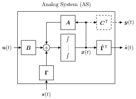

Analog System
=================

The analog system is defined by the linear differential equation

:math:`\dot{\mathbf{x}}(t) = \mathbf{A} \mathbf{x}(t) + \mathbf{B}
\mathbf{u}(t) + \mathbf{\Gamma} \mathbf{s}(t)` 

where :math:`\mathbf{A}` is the system matrix, :math:`\mathbf{B}` is the
input matrix, and :math:`\mathbf{\Gamma}` is the control matrix.

>>> 5 
5

To create a Analog system we use the class 

