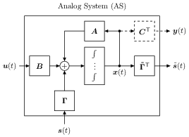

====================
Old stuff
====================

The control-bounded A/D conversion concept is a new A/D conversion paradigm
reminiscent of the delta-sigma modulator conversion architecture. An in depth
introduction to control-bounded A/D conversion can be found here 
`control-bounded converters
<https://www.research-collection.ethz.ch/bitstream/handle/20.500.11850/469192/control-bounded_converters_a_dissertation_by_hampus_malmberg.pdf?sequence=1&isAllowed=y#page=28/>`_.

The general structure of this documentation is given in. Regardless, we want to make
the reader aware of the two main sections:

* :doc:`control-bounded_converters` which gives a detailed documentation of the included classes and structure of the package
   as well as describing the control-bounded conversion concepts.  
* :doc:`tutorials/tutorials` which provides plenty of code examples demonstrating the main functionality of the package.
* something with transfer functions and analytical...

.. image:: images/controlBoundedConverterOverview.png
   :width: 400
   :alt: A control-bounded A/D converter overview.

Analog Signal
-------------
the analog signal...

Analog System
-------------

The analog system is defined by the linear differential equation

:math:`\dot{\mathbf{x}}(t) = \mathbf{A} \mathbf{x}(t) + \mathbf{B}
\mathbf{u}(t) + \mathbf{\Gamma} \mathbf{s}(t)` 

where :math:`\mathbf{A}` is the system matrix, :math:`\mathbf{B}` is the
input matrix, and :math:`\mathbf{\Gamma}` is the control matrix.

>>> 5 
5

To create a Analog system we use the class 

Digital Control
---------------

.. _digital_estimator:

Digital Estimator
-----------------

.. minigallery:: cbadc.DigitalEstimator
    :add-heading:

